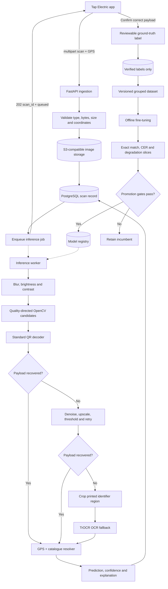

# Tap Electric QR Recovery Service

[](https://www.python.org/)
[](https://fastapi.tiangolo.com/)
[](#run-tests)

An interview-ready prototype for collecting degraded EV-charger sticker scans,
recovering their existing QR payloads, confirming ground truth, and improving an
OCR fallback from verified examples.

> The QR code already contains the required charger identifiers. Therefore the
> optimization target is not generating new charger information, but increasing
> the probability of correctly recovering the existing QR payload from degraded
> camera images.

## Problem

Mobile QR readers work well on clean stickers but may fail when the image is
blurry, dark, overexposed, faded, noisy, rotated, photographed at an angle, or
partially damaged. This service creates the feedback loop that is missing after
such a failure:

1. Durably collect the image and useful non-personal capture metadata.
2. Try inexpensive QR-specific recovery before invoking ML.
3. Use location and the known charger catalogue to rank plausible candidates.
4. Accept verified ground truth and train only from trusted labels.
5. Evaluate a candidate model against frozen baselines before promotion.

## Key decisions

- **QR decoding comes first.** QR codes have error correction and geometric
  structure that a standard decoder understands; a general OCR model does not.
- **TrOCR has a narrow role.** `microsoft/trocr-base-printed` reads the
  human-readable charger/connector identifier commonly printed around a QR code.
  It is not presented as a QR-matrix decoder.
- **Inference is asynchronous.** The API stores the image and metadata, queues a
  worker job, and returns `202 Accepted`.
- **Storage is split by data shape.** PostgreSQL stores metadata and labels;
  S3-compatible object storage stores image and model blobs.
- **Only verified labels train the model.** A user correction is pending until a
  trusted confirmation source or review marks it eligible.
- **The prototype stays small.** FastAPI `BackgroundTasks` represents the worker
  boundary locally. A queue can replace it without changing the inference service.

## Architecture



The apparent cross-store transaction is deliberately ordered: upload the image,
commit the scan record, then enqueue inference. If the database commit fails, the
API deletes the uploaded object as compensation. In production an outbox pattern
would make job publication reliable across process crashes.

## API

Interactive OpenAPI documentation is available at
`http://localhost:8000/docs`.

| Method | Route | Purpose |
|---|---|---|
| `POST` | `/api/v1/scans` | Store a scan and queue inference |
| `GET` | `/api/v1/scans/{scan_id}` | Read processing state and predictions |
| `POST` | `/api/v1/scans/{scan_id}/confirm` | Add reviewable ground truth |
| `POST` | `/api/v1/inference` | Synchronously exercise the pipeline |
| `POST` | `/api/v1/training/run` | Start dry-run or real offline training |
| `GET` | `/api/v1/training/runs/{run_id}` | Read training status |
| `GET` | `/api/v1/models` | List model versions and evaluation metrics |
| `GET` | `/health` | Liveness check |

Create a scan:

```bash
curl -X POST http://localhost:8000/api/v1/scans \
  -F "image=@charger.jpg" \
  -F "latitude=52.3676" \
  -F "longitude=4.9041" \
  -F "timestamp=2026-08-23T12:00:00Z" \
  -F "gps_accuracy_meters=8" \
  -F "client_scan_id=mobile-0193" \
  -F "native_qr_success=false"
```

The response is intentionally non-blocking:

```json
{
  "scan_id": "de305d54-75b4-431b-adb2-eb6b9e546014",
  "status": "queued",
  "image_uri": "local://de305d54-75b4-431b-adb2-eb6b9e546014.jpg"
}
```

Confirm the label after a trusted workflow has established the correct charger:

```bash
curl -X POST http://localhost:8000/api/v1/scans/SCAN_ID/confirm \
  -H "Content-Type: application/json" \
  -d '{
    "correct_qr_payload": "https://tap-electric.com/c/NL-TAP-E12345",
    "charger_id": "NL-TAP-E12345",
    "confirmation_source": "operator",
    "verified": true
  }'
```

`client_scan_id` provides idempotency for mobile retries. Files are limited to a
configurable size and decoded before storage, rather than trusting the MIME header.

## Data model

| Entity | Responsibility |
|---|---|
| `Scan` | Image URI, capture context, quality signals, all pipeline outputs and status |
| `ScanLabel` | Correct payload, charger ID, provenance, review state and eligibility |
| `Charger` | Known payload and coordinates used for explainable GPS validation |
| `DatasetVersion` | Immutable manifest, example count and grouping policy |
| `TrainingRun` | Asynchronous job state and produced dataset/model versions |
| `ModelVersion` | Artifact path, end-to-end metrics and promotion state |

UUIDs and scan/session identifiers are used instead of user identity. Raw image
bytes are never stored in PostgreSQL. The SQLAlchemy schema works with PostgreSQL;
SQLite and local object storage keep development and tests self-contained.

## Inference pipeline

### 1. Quality analysis

- Blur/sharpness: variance of the grayscale Laplacian.
- Brightness: mean grayscale intensity classified as `too_dark`, `normal`, or
  `too_bright`.
- Contrast: grayscale standard deviation.

These measurements select a small set of preprocessing candidates. For example,
dark/low-contrast images get CLAHE and adaptive thresholding, while blurry images
get a conservative unsharp mask. The system does not destructively apply every
transformation in sequence.

### 2. QR-specific recovery

OpenCV `QRCodeDetector` is tried against the original and quality-directed
candidates. If they fail, a more expensive restoration pass denoises, upscales,
enhances contrast, thresholds, and retries. A successful QR decode stops the ML
fallback.

### 3. TrOCR fallback

The prototype integrates
[`microsoft/trocr-base-printed`](https://huggingface.co/microsoft/trocr-base-printed),
a small, understandable Hugging Face image-to-text model for printed text. It is
lazy-loaded only when `ENABLE_TROCR=true` and operates on a configurable printed-ID
region of interest. Fine-tuning targets the verified `charger_id` visible on the
sticker; the charger catalogue then maps that identifier back to the complete QR
payload.

This demonstrates model integration and fine-tuning while staying technically
honest. Production QR recovery may benefit more from QR localization,
perspective/crease correction, learned super-resolution, segmentation, multiple
video frames, or a QR-specific restoration model. The fixed lower-sticker crop is
also only a prototype; a production system needs sticker layout metadata or text
region detection.

### 4. Location-aware resolution

The resolver fetches active chargers in a geographical bounding box, applies an
exact Haversine distance, and ranks candidates with an explicit score:

```text
0.55 × text similarity + 0.25 × distance score + 0.20 × source confidence
```

Candidates below the text-similarity safety threshold are not silently replaced.
The API records an explanation with the final choice. GPS is corroborating
evidence, never permission to invent missing information.

## Training pipeline

Only `ScanLabel.training_eligible=true` examples enter a manifest. The manifest
contains the object URI, exact payload, charger, split, and degradation category.
Its content-derived version makes the training input reproducible.

Splits are deterministic and grouped by charger, so the same physical charger is
not represented across train, validation, and test. Identical image hashes are
also forced into one split. A production dataset should additionally maintain a
sticker identity, perceptual hash and capture burst/session group. A temporal,
unseen-charger test set gives the strongest evidence against memorization.

Training-only augmentations simulate the stated failures:

- Gaussian and motion blur
- darkness and overexposure
- sensor noise and reduced contrast/fading
- small rotations and perspective distortion

Labels are never transformed. The optional real training path uses
`TrOCRProcessor`, `VisionEncoderDecoderModel`, a PyTorch `Dataset`,
`Seq2SeqTrainer`, checkpoint selection, and artifact saving. The saved checkpoint
is then evaluated through the complete QR/OCR/GPS pipeline before promotion.
Dry-run mode validates dataset construction without importing PyTorch or
downloading a model.

### Hybrid dataset and interview notebook

The repository includes a reproducible synthetic sticker generator and a
normalized importer shared by synthetic, public, physical, and future Tap data:

```powershell
python -m pip install -e ".[dev,notebook]"
python -m scripts.generate_synthetic_dataset `
  --chargers 500 `
  --variants-per-charger 10 `
  --seed 42
python -m scripts.import_dataset --manifest data/synthetic/manifest.json
jupyter lab notebooks/hybrid_dataset_demo.ipynb
```

The committed [hybrid dataset notebook](notebooks/hybrid_dataset_demo.ipynb) is
already executed for GitHub viewing. It generates a small 60-image demonstration,
shows clean/degraded scans, charts baseline recovery and quality signals, and
asserts that each sticker remains in one split. Large generated files and public
datasets remain outside Git; see [the dataset strategy](docs/dataset_strategy.md)
for sources, licence notes, manifest format, and physical-capture guidance.

## Validation and promotion

The most important metric is **exact payload match**: a partially correct charger
identifier is usually not actionable. Supporting metrics are:

- Character error rate (Levenshtein edits divided by reference characters)
- Recovery rate on scans that previously failed
- Accuracy on clean images
- Accuracy for blurry, dark, bright, and noisy/faded slices
- Final charger-resolution accuracy and confidence calibration in production

Evaluation should compare the native app, raw OpenCV, adaptive preprocessing,
restoration retry, OCR/GPS fallback, and full end-to-end system. The immutable test
set is used for final reporting, not checkpoint selection.

A candidate must improve exact recovery by a configurable minimum, must not
regress degraded scans, and may lose no more than one percentage point on clean
images. Every rejected model and the gate reason remain auditable.

## Parallelism and scale

The API, inference worker, and trainer have separate service boundaries. FastAPI
`BackgroundTasks` keeps this repository runnable without Redis. At production
scale:

- Publish scan IDs with a transactional outbox to SQS, Kafka, or a similar queue.
- Run CPU OpenCV workers and GPU OCR workers in separate autoscaling pools.
- Cache the promoted model once per worker process.
- Batch GPU inference where latency permits.
- Run training on scheduled, immutable dataset snapshots.
- Store model artifacts in object storage and deploy through a controlled registry.

## Privacy and security

Coordinates and camera images may be sensitive even without a user ID. A
production deployment should:

- Use short, configurable retention for raw images (30 days by default).
- Encrypt storage and transport and restrict training-image access by role.
- Strip unnecessary EXIF metadata before long-term retention.
- Reduce coordinate precision in analytics that do not need exact location.
- Support deletion by scan/session ID across PostgreSQL, object storage and
  derived datasets.
- Authenticate confirmation and training endpoints and audit reviewer actions.
- Scan uploads for malicious content and enforce pixel/dimension limits in
  addition to the implemented byte and MIME limits.

This prototype avoids names, emails, advertising IDs, and other unnecessary
identity fields.

## Limitations and production improvements

- Background tasks are process-local and are not durable across crashes.
- SQLite is a local convenience, not the production database.
- The S3 adapter is implemented but not exercised without credentials.
- TrOCR is disabled by default and no accuracy claim is made without real data.
- A fixed printed-ID crop cannot cover every sticker layout.
- The demonstration confidence weights are explainable heuristics and require
  calibration on Tap Electric data.
- Labels marked `verified=true` are trusted by the prototype; production must
  derive that permission from authenticated reviewer roles.
- Schema creation uses `create_all`; production should use Alembic migrations.

With more time, prioritize a multi-frame mobile capture flow, QR region detection,
perceptual duplicate detection, an authenticated review UI, durable job delivery,
confidence calibration, observability, and shadow evaluation before automated
model promotion.

## Run locally

Prerequisites: Python 3.11+.

```bash
python -m venv .venv
# Windows PowerShell
.venv\Scripts\Activate.ps1
python -m pip install -e ".[dev]"
copy .env.example .env
python -m scripts.seed_chargers
uvicorn app.main:app --reload
```

The local defaults use `data/tap_qr.db` and `data/images/`. To enable inference
with an already downloaded model:

```bash
python -m pip install -e ".[ml,dev]"
# .env
ENABLE_TROCR=true
TROCR_LOCAL_FILES_ONLY=true
```

Set `TROCR_LOCAL_FILES_ONLY=false` only when downloading the Hugging Face weights
is intentional.

### Docker

Docker Compose runs the API with PostgreSQL while retaining local object storage:

```bash
docker compose up --build
docker compose exec api python -m scripts.seed_chargers
```

Real infrastructure is not required for the demo. Set `OBJECT_STORAGE_BACKEND=s3`
and install the `s3` extra when targeting AWS S3, MinIO, or another compatible
service.

## Run tests

```bash
python -m pytest
python -m pytest --cov=app --cov-report=term-missing
ruff check .
```

Tests use temporary SQLite databases and local directories. They exercise a real
OpenCV QR decode but mock/disable the heavy Hugging Face path, so no model is
downloaded.

## Repository layout

```text
app/
├── api/routes/             # Scan, inference, training and model APIs
├── core/                   # Configuration and logging
├── db/                     # SQLAlchemy schema and sessions
├── ml/                     # Dataset, augmentation, metrics, training and gates
├── repositories/           # Persistence boundaries
├── schemas/                # Pydantic request/response contracts
└── services/               # Storage and inference/training orchestration
scripts/                    # Demo charger seed command
notebooks/                  # Executed hybrid-data interview demonstration
docs/                       # Dataset provenance and normalized manifest contract
tests/                      # Fast unit and API tests
Dockerfile
docker-compose.yml
pyproject.toml
```

## Scope

The repository intentionally demonstrates sound design rather than pretending to
be a finished production ML platform. It implements the important seams—durable
collection, deterministic recovery, honest ML fallback, trusted feedback,
leakage-aware datasets, meaningful metrics and guarded promotion—without adding a
distributed stack that would obscure those decisions in a three-hour interview.
