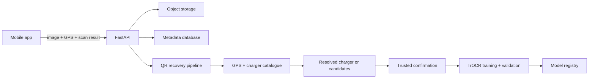

# Tap Electric QR Recovery Service

[](https://www.python.org/)
[](https://fastapi.tiangolo.com/)
[](#tests)

A backend service that collects EV-charger sticker scans, recovers QR
payloads from degraded images, and improves an OCR fallback from verified data.

## Problem and approach

QR stickers may fail because of blur, darkness, glare, fading, rotation, or
perspective distortion. The normal phone scanner remains the fastest path.
This service stores the scan and context, then runs a recovery pipeline when the
native scan fails:

```text
Native scanner
  -> OpenCV QR decoder
  -> ZXing-C++ QR decoder
  -> TrOCR printed-ID fallback
  -> GPS + charger-catalogue resolution
```

A clear match returns one charger. An ambiguous match returns up to three nearby
candidates with distance and match scores for manual selection. The service does
not guess when confidence is insufficient.

## System flow



Every scan is collected. Successful native scans can be submitted without
blocking the user; failed scans continue through recovery.

## What is implemented

- Multipart scan ingestion with GPS, capture, device, app, and native-decoder
  metadata.
- Idempotent mobile retries and asynchronous background processing.
- Local and S3-compatible object-storage adapters.
- SQLite for local use and PostgreSQL-compatible SQLAlchemy models for production.
- Image-quality analysis and quality-directed OpenCV preprocessing.
- OpenCV and ZXing-C++ QR decoding.
- Optional `microsoft/trocr-base-printed` inference for printed charger IDs.
- GPS-radius filtering, Haversine distance, text matching, confidence scoring,
  and ranked manual candidates.
- Verified labels, versioned grouped datasets, augmentation, TrOCR fine-tuning,
  evaluation, model registration, and promotion gates.
- Automated linting and 22 tests.

## Storage choices

| Data | Local default | Production design |
|---|---|---|
| Images | `data/images/` | S3-compatible object storage |
| Metadata and labels | SQLite | PostgreSQL |
| Model artifacts | `models/` | Versioned model/object storage |

Images stay out of the relational database. PostgreSQL stores their URI plus scan
metadata, labels, chargers, dataset versions, training runs, and model versions.
Production infrastructure is represented through configurable adapters and is
not provisioned in this repository.

## API

Interactive documentation is available at `http://localhost:8000/docs`.

| Method | Endpoint | Purpose |
|---|---|---|
| `POST` | `/api/v1/scans` | Store a scan and start processing |
| `GET` | `/api/v1/scans/{scan_id}` | Return status, result, or ranked candidates |
| `POST` | `/api/v1/scans/{scan_id}/confirm` | Add trusted ground truth |
| `POST` | `/api/v1/inference` | Run the recovery pipeline synchronously |
| `POST` | `/api/v1/training/run` | Start dataset creation or fine-tuning |
| `GET` | `/api/v1/training/runs/{run_id}` | Read training status |
| `GET` | `/api/v1/models` | List model versions and metrics |
| `GET` | `/health` | Health check |

## Model training and validation

Only verified examples enter training. A trusted label can come from another
successfully decoded frame, a confirmed charging session, or manual review.
Unverified model predictions never become training labels automatically.

The dataset is split 70/15/15 into train, validation, and test sets. Splitting is
grouped by charger and protected against duplicate-image leakage. Training applies
blur, brightness, noise, contrast, rotation, and perspective augmentation.

Validation measures:

- exact-match accuracy;
- character error rate;
- recovery rate on previously failed scans;
- clean-scan accuracy;
- degraded-scan accuracy.

A candidate model is promoted only when exact-match accuracy improves by at
least 1%, degraded performance does not regress, and clean accuracy drops by no
more than 1%.

## Dataset evaluation

[Open the hybrid dataset evaluation](notebooks/hybrid_dataset_demo.ipynb).
It generates labelled charger stickers, applies controlled degradation, checks
split leakage, and compares decoders. In the committed 60-image evaluation:

- OpenCV baseline: **51/60 (85%)**
- Multi-pass OpenCV + ZXing-C++: **56/60 (93.3%)**

These are synthetic benchmark results and are reported separately from production
metrics. The executable TrOCR fine-tuning path is included; production training
requires verified domain data.

## Run locally

```powershell
python -m venv .venv
.\.venv\Scripts\Activate.ps1
python -m pip install -e ".[dev]"
uvicorn app.main:app --reload
```

To enable TrOCR, install the ML dependencies and configure model download:

```powershell
python -m pip install -e ".[ml,dev]"
$env:ENABLE_TROCR = "true"
$env:TROCR_LOCAL_FILES_ONLY = "false"
uvicorn app.main:app --reload
```

PostgreSQL can be run locally with:

```powershell
docker compose up --build
docker compose exec api python -m scripts.seed_chargers
```

## Tests

```powershell
python -m pytest
ruff check .
```

## Current scope

- TrOCR is disabled by default and requires model weights plus additional ML
  dependencies.
- The printed-ID crop uses a fixed region; production needs sticker-layout
  metadata or text-region detection.
- FastAPI background tasks represent the worker boundary; production should use a
  durable queue and separate inference/training workers.
- Database tables use SQLAlchemy `create_all`; production should use migrations.
- The repository contains backend APIs, not a mobile candidate-selection UI.

## License

MIT
